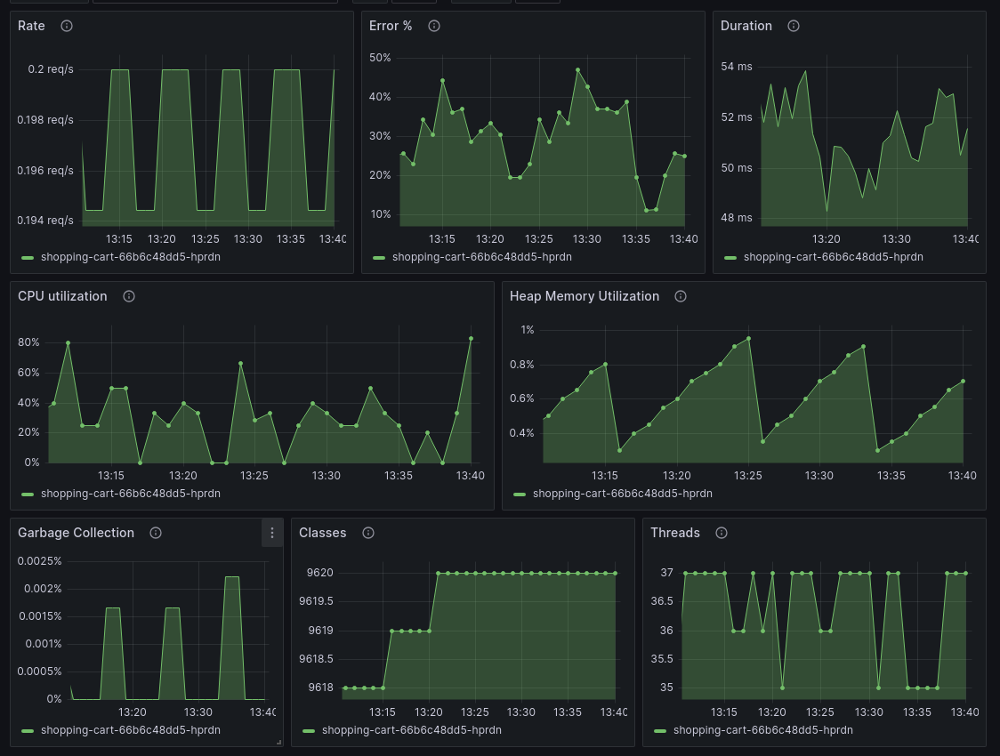

## Overview

> ⚠️ This project is archived and no longer maintained.
> 
> The Grafana OpenTelemetry Starter is deprecated and will not receive any further updates.
> 
> If you are looking for a way to get started with OpenTelemetry in Java for **Grafana Cloud** or Grafana OSS,  
> please use the [Grafana OpenTelemetry Distribution for Java](https://github.com/grafana/grafana-opentelemetry-java).
> 
> If you are looking for an OpenTelemetry **Spring Boot starter**, please use the 
> [OpenTelemetry Spring Boot Starter](https://opentelemetry.io/docs/zero-code/java/spring-boot-starter/).

The grafana-opentelemetry-starter makes it easy to use Metrics, Traces, and Logs with OpenTelemetry
in Grafana Cloud or the Grafana OSS stack.

## Compatibility

| Spring Boot Version | Java Version | Recommended Setup                                                                                        |
|---------------------|--------------|----------------------------------------------------------------------------------------------------------|
| 3.2.x               | 17+          | Use this starter in version 1.4.x                                                                        |
| 3.1.x               | 17+          | Use this starter in version 1.3.x                                                                        |
| 3.0.4 < 3.1.0       | 17+          | Use this starter in version 1.0.0 (only works with gradle)                                               |
| 2.x                 | 8+           | Use [Grafana OpenTelemetry Distribution for Java](https://github.com/grafana/grafana-opentelemetry-java) |

Logging is supported with Logback and Log4j2 
(a separate appender is added automatically, leaving your console or file appenders untouched).

## Getting Started

Follow these three steps to get started with Grafana OpenTelemetry:

- [Add the Grafana OpenTelemetry Starter dependency](#step-1-add-the-grafana-opentelemetry-starter-dependency)
- [Configure the application](#step-2-configuration)
- [Observe the service in Application Observability](#step-3-observe-the-service-in-application-observability)

### Step 1: Add the Grafana Opentelemetry Starter dependency

Add the following dependency to your `build.gradle`

```groovy
implementation 'com.grafana:grafana-opentelemetry-starter:1.4.0'
```

... or `pom.xml`

```xml
<dependency>
    <groupId>com.grafana</groupId>
    <artifactId>grafana-opentelemetry-starter</artifactId>
    <version>1.4.0</version>
</dependency>
```

### Step 2: Configuration

Next, configure your application either for [Grafana Cloud OTLP Gateway](#grafana-cloud-otlp-gateway) 
or [Grafana Agent](#grafana-agent).

#### Grafana Cloud OTLP Gateway

> ⚠️ Please use the Grafana Agent configuration for production use cases.

The easiest setup is to use the Grafana Cloud OTLP Gateway, because you don't need to run any service to transport
the telemetry data to Grafana Cloud. 
The Grafana Cloud OTLP Gateway is a managed service that is available in all Grafana Cloud plans.

1. Sign in to [Grafana Cloud](https://grafana.com), register for a Free Grafana Cloud account if required.

2. After successful login, the browser will navigate to the Grafana Cloud Portal page <https://grafana.com/profile/org>.

   A new account will most likely belong to one organization with one stack.

   If the account has access to multiple Grafana Cloud Organizations, select an organization from the
   top left **organization dropdown**.

   If the organization has access to multiple Grafana Cloud Stacks, navigate to a stack from the **left side bar**
   or the main **Stacks** list.

3. With a stack selected, or in the single stack scenario, below **Manage your Grafana Cloud Stack**,
   click **Configure** in the **OpenTelemetry** section:

   

4. In the **Password / API Token** section, click on **Generate now** to create a new API token:
   - Give the API token a name, for example `otel-java`
   - Click on **Create token**
   - Click on **Close** without copying the token
   - Now the environment variables section is populated with all the necessary information to send telemetry data
     to Grafana Cloud
   - Click on **Copy to Clipboard** to copy the environment variables to the clipboard

   

5. Come up with a **Service Name** to identify the service, for example `cart`, and copy it into the shell command
   below. Use the `service.namespace` to group multiple services together.
6. Optional: add resource attributes to the shell command below:
   - **deployment.environment**: Name of the deployment environment, for example `staging` or `production`
   - **service.namespace**: A namespace to group similar services, for example using `service.namespace=shop` for a
     `cart` and `fraud-detection` service would create `shop/cart` and `shop/fraud-detection` in Grafana Cloud
     Application Observability with filtering capabilities for easier management
   - **service.version**: The application version, to see if a new version has introduced a bug
   - **service.instance.id**: The unique instance, for example the Pod name (a UUID is generated by default)

```shell
<Paste the environment variables from the previous section>
export OTEL_SERVICE_NAME=<Service Name>
export OTEL_RESOURCE_ATTRIBUTES=deployment.environment=<Environment>,service.namespace=<Namespace>,service.version=<Version>
```
                                                    
Finally, [Observe the service in Application Observability](#step-3-observe-the-service-in-application-observability).

#### Grafana Agent

The Grafana Agent is a single binary that can be deployed as a sidecar or daemonset in Kubernetes, or as a service 
in your network. It provides an endpoint where the application can send its telemetry data to.
The telemetry data is then forwarded to Grafana Cloud or a Grafana OSS stack.

> 💨 Skip this section and let the [OpenTelemetry Integration](https://grafana.com/docs/grafana-cloud/data-configuration/integrations/integration-reference/integration-opentelemetry/)
> create everything for you.

1. If the Grafana Agent is not running locally or doesn't use the default grpc endpoint,
   adjust OTEL_EXPORTER_OTLP_ENDPOINT or OTEL_EXPORTER_OTLP_PROTOCOL (to `http/protobuf`).
2. Choose a **Service Name** to identify the service.
3. Optionally, add attributes to filter data:
   - **deployment.environment**: Name of the deployment environment (`staging` or `production`)
   - **service.namespace**: A namespace to group similar services
     (e.g. `shop` would create `shop/cart` in Application Observability)
   - **service.version**: The application version, to see if a new version has introduced a bug
   - **service.instance.id**: The unique instance, for example the Pod name (a UUID is generated by default)

```shell
export OTEL_EXPORTER_OTLP_ENDPOINT=http://localhost:4317
export OTEL_EXPORTER_OTLP_PROTOCOL=grpc
export OTEL_SERVICE_NAME=<Service Name>
export OTEL_RESOURCE_ATTRIBUTES=deployment.environment=<Environment>,service.namespace=<Namespace>,service.version=<Version>
```

The application will send data to the Grafana Agent. Please follow the
[Grafana Agent configuration for OpenTelemetry](https://grafana.com/docs/opentelemetry/instrumentation/configuration/grafana-agent/)
guide.

Finally, [Observe the service in Application Observability](#step-3-observe-the-service-in-application-observability).

### Step 3: Observe the Service in Application Observability

Finally, make some requests to the service to validate data is sent to Grafana Cloud.
It might take up to five minutes for data to appear.

In Grafana, replace the path of the URL with `/a/grafana-app-observability-app/services` or:

1. Click on the menu icon in the top left corner
2. Open the _Observability_ menu
3. Click on _Application_

**Important**: refer to the [troubleshooting guide](#troubleshooting) if there is no data in Application Observability.

### Grafana Dashboard

Once you've started your application, you can use this [Spring Boot Dashboard](https://grafana.com/grafana/dashboards/18887)



### Getting Help 

If anything is not working, or you have questions about the starter, we’re glad to help you on our 
[community chat](https://slack.grafana.com/) (#opentelemetry).

## Reference

- All configuration properties are described in the [reference](#properties).
- The `grafana.otlp.cloud` and `grafana.otlp.onprem` properties are mutually exclusive.
- As usual in Spring Boot, you can use environment variables to supply some of the properties, which is especially
  useful for secrets, e.g. `GRAFANA_OTLP_CLOUD_API_KEY` instead of `grafana.otlp.cloud.apiKey`.
- In addition, you can use all system properties or environment variables from the
  [SDK auto-configuration](https://github.com/open-telemetry/opentelemetry-java/tree/main/sdk-extensions/autoconfigure) -
  which will take precedence.

### Troubleshooting

When you start the application, you will also get a log output of the configuration properties as they are translated into SDK properties.

For example, if you set the `spring.application.name` in `application.yaml`,
you will get the following log output:

```
11:53:07.724 [main] INFO  c.g.o.OpenTelemetryConfig - using config properties: {otel.exporter.otlp.endpoint=https://otlp-gateway-prod-eu-west-0.grafana.net/otlp, otel.logs.exporter=otlp, otel.traces.exporter=otlp, otel.exporter.otlp.headers=Authorization=Basic NTUz..., otel.exporter.otlp.protocol=http/protobuf, otel.resource.attributes=service.name=demo-app, otel.metrics.exporter=otlp}
```

(The `otel.exporter.otlp.headers` field is abbreviated for security reasons.)

If you still don't see your logs, traces and metrics in Grafana, even though the configuration looks good, 
you can turn on [debug logging](#grafanaotlpdebuglogging) to what data the application is emitting.

### Properties

#### grafana.otlp.globalAttributes

Adds global (resource) attributes to metrics, traces and logs.

For example, you can add `service.version` to make it easier to see if a new version of the application is causing a problem.


The attributes `service.name`, `service.version`, and `service.instance.id` are automatically detected as outlined below.


For `service.name` the order of precedence is: <ol> <li>environment variable OTEL_SERVICE_NAME</li> <li>environment variable OTEL_RESOURCE_ATTRIBUTES</li> <li>Manually set service_name in grafana.otlp.grafana.otlp.globalAttributes</li> <li>spring.application.name" in application.properties</li> <li>'Implementation-Title' in jar's MANIFEST.MF</li> </ol>

The following block can be added to build.gradle to set the application name and version in the jar's MANIFEST.MF: <pre> bootJar { manifest { attributes('Implementation-Title': 'Demo Application', 'Implementation-Version': version) } } </pre> The `service.instance.id` attribute will be set if any of the following return a value. The list is in order of precedence. <ol> <li>InetAddress.getLocalHost().getHostName()</li> <li>environment variable HOSTNAME</li> <li>environment variable HOST</li> </ol>

#### grafana.otlp.debugLogging

Log all metrics, traces, and logs that are created for debugging purposes (in addition to sending them to the backend via OTLP).

This will also send metrics and traces to Loki as an unintended side effect.

#### grafana.otlp.enabled

Enable or disable the OpenTelemetry integration (default is enabled).

This can be used to disable the integration without removing the dependency.

#### grafana.otlp.cloud.zone

The Zone can be found when you click on "Details" in the "Grafana" section on grafana.com.

Use `onprem.grafana.otlp.onprem.endpoint` instead of `grafana.otlp.cloud.zone` when using the Grafana Agent.

#### grafana.otlp.cloud.instanceId

The Instance ID can be found when you click on "Details" in the "Grafana" section on grafana.com.

Leave `grafana.otlp.cloud.instanceId` empty when using the Grafana Agent.

#### grafana.otlp.cloud.apiKey

Create an API key under "Security" / "API Keys" (left side navigation tree) on grafana.com. The role should be "MetricsPublisher"

Leave `grafana.otlp.cloud.apiKey` empty when using the Grafana Agent.

#### grafana.otlp.onprem.endpoint

The grafana.otlp.onprem.endpoint of the Grafana Agent.

You do not need to set an `grafana.otlp.onprem.endpoint` value if your Grafana Agent is running locally with the default gRPC grafana.otlp.onprem.endpoint (localhost:4317).

Use `cloud.grafana.otlp.cloud.zone` instead of `grafana.otlp.onprem.endpoint` when using the Grafana Cloud.

#### grafana.otlp.onprem.protocol

The grafana.otlp.onprem.protocol used to send OTLP data. Can be either `http/protobuf` or `grpc` (default).
